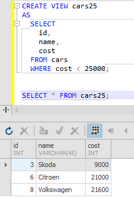
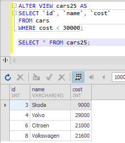
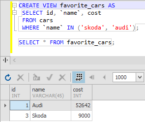
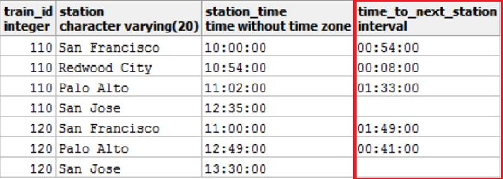
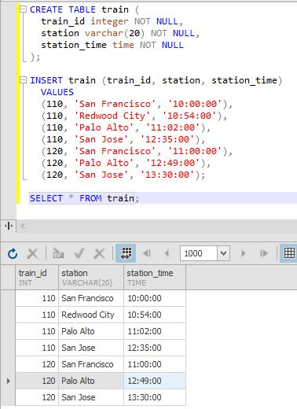
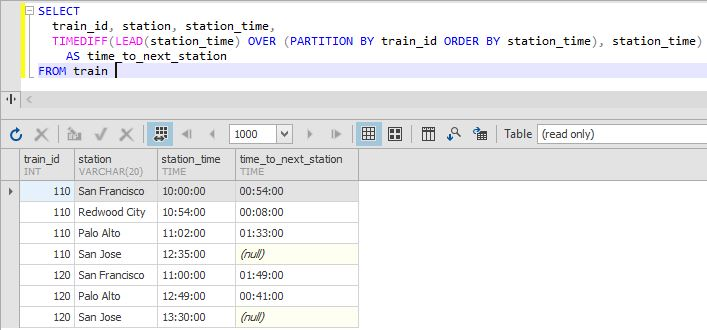
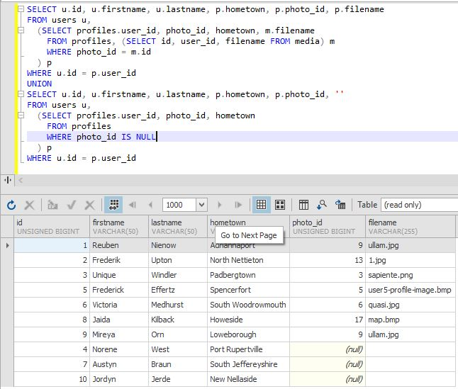

# Базы данных и SQL

## SQL – оконные функции

### Задание 1

Создайте представление, в которое попадут автомобили стоимостью  до 25 000 долларов

```sql
CREATE VIEW cars25 AS
 SELECT id, name, cost
 FROM cars
 WHERE cost < 25000;
```



### Задание 2

Изменить в существующем представлении порог для стоимости: пусть цена будет до 30 000 долларов (используя оператор ALTER VIEW) 

```sql
ALTER VIEW cars25 AS
 SELECT `id`, `name`, `cost`
 FROM cars
 WHERE cost < 30000;
```



### Задание 3

Создайте представление, в котором будут только автомобили марки “Шкода” и “Ауди”

```sql
CREATE VIEW favorite_cars AS
 SELECT id, `name`, cost
 FROM cars
 WHERE `name` IN ('skoda', 'audi');
```



### Задание 4

Добавьте новый столбец под названием «время до следующей станции». Чтобы получить это значение, мы вычитаем время станций для пар смежных станций. Мы можем вычислить это значение без использования оконной функции SQL, но это может быть очень сложно. Проще это сделать с помощью оконной функции LEAD . Эта функция сравнивает значения из одной строки со следующей строкой, чтобы получить результат. В этом случае функция сравнивает значения в столбце «время» для станции со станцией сразу после нее.



**Подготовка данных**

```sql
CREATE TABLE train (
  train_id integer NOT NULL,
  station varchar(20) NOT NULL,
  station_time time NOT NULL
);

INSERT train 
    (train_id, station, station_time)
  VALUES 
    (110, 'San Francisco', '10:00:00'),
    (110, 'Redwood City', '10:54:00'),
    (110, 'Palo Alto', '11:02:00'),
    (110, 'San Jose', '12:35:00'),
    (120, 'San Francisco', '11:00:00'),
    (120, 'Palo Alto', '12:49:00'),
    (120, 'San Jose', '13:30:00');
```



**Построение запроса**

```sql
SELECT
  train_id, station, station_time,
  TIMEDIFF(LEAD(station_time) OVER (PARTITION BY train_id ORDER BY station_time), station_time) 
    AS time_to_next_station 
FROM train 
```



### Доп. задачки (sem4_5.sql)

Выбрать всех пользователей, указав их ```id```, ```имя``` и ```фамилию```, ```город``` и ```аватарку``` (используя вложенные запросы)

```sql
SELECT u.id, u.firstname, u.lastname, p.hometown, p.photo_id, p.filename
FROM users u, 
  (SELECT profiles.user_id, photo_id, hometown, m.filename 
    FROM profiles, (SELECT id, user_id, filename FROM media) m 
    WHERE photo_id = m.id
  ) p
WHERE u.id = p.user_id 
UNION
SELECT u.id, u.firstname, u.lastname, p.hometown, p.photo_id, ''
FROM users u, 
  (SELECT profiles.user_id, photo_id, hometown
    FROM profiles
    WHERE photo_id IS NULL
  ) p
WHERE u.id = p.user_id 
```



Список медиафайлов пользователей, указав название типа медиа ```(id, filename, name_type)``` (используя ```JOIN```)

```sql

```


Найдите друзей у друзей пользователя с ```id = 1```. (решение задачи с помощью представления “друзья”)

```sql

```


Найдите друзей у друзей пользователя с ```id = 1``` и поместите выборку в представление;

```sql

```
